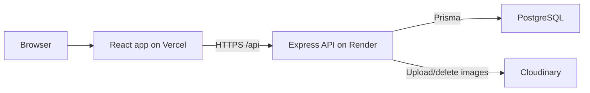

# FrameHub

FrameHub is a production-ready full-stack photo gallery platform for uploading, organizing, and sharing photos.

- Live app: https://gallery-ebon-six.vercel.app/
- Backend API: https://gallery-39ia.onrender.com/
- Health check: https://gallery-39ia.onrender.com/health
- Repository: https://github.com/char704/gallery

## Tech Stack

- Client: React 18, Vite, TypeScript, Tailwind CSS, React Router, TanStack Query, Zustand
- Server: Node.js 20, Express, TypeScript, Prisma, PostgreSQL, JWT auth
- Storage: Cloudinary image uploads with UUID public IDs under per-user folders
- Testing: Vitest, React Testing Library, Supertest-ready integration tests
- Deployment: Vercel frontend, Render backend

## Architecture



## Working Features

- Register and login with email/password validation and bcrypt password hashing.
- JWT-based protected routes with persisted client sessions.
- `/api/auth/me` session hydration after browser refresh.
- Authenticated photo upload to Cloudinary with MIME/signature validation.
- UUID-based Cloudinary public IDs in `framehub/{userId}/{uuid}` to prevent collisions.
- Photo metadata persisted in PostgreSQL through Prisma.
- Personal gallery with pagination at `/gallery`.
- Public gallery with pagination at `/explore`.
- Home page recent photos loaded from the live API.
- Photo detail page with owner-only edit/delete actions and delete confirmation.
- Integration tests for auth, photo authorization, and privacy behavior.

## Project Structure

```text
framehub/
|-- client/
|   |-- public/
|   |-- src/
|   |   |-- components/
|   |   |-- hooks/
|   |   |-- pages/
|   |   |-- services/
|   |   |-- store/
|   |   |-- test/
|   |   |-- types/
|   |   `-- utils/
|   |-- .env.example
|   |-- package.json
|   |-- vercel.json
|   `-- vite.config.ts
|-- server/
|   |-- prisma/
|   |   `-- schema.prisma
|   |-- src/
|   |   |-- __tests__/
|   |   |-- config/
|   |   |-- controllers/
|   |   |-- middlewares/
|   |   |-- routes/
|   |   |-- services/
|   |   |-- types/
|   |   |-- utils/
|   |   `-- validators/
|   |-- .env.example
|   |-- package.json
|   `-- tsconfig.json
|-- DEPLOYMENT.md
`-- README.md
```

## Local Setup

Install dependencies in each app:

```bash
cd client
npm install

cd ../server
npm install
```

Create local environment files from the examples:

```bash
cp client/.env.example client/.env
cp server/.env.example server/.env
```

Generate Prisma Client and prepare the local database:

```bash
cd server
npm run prisma:generate
npm run prisma:migrate
```

Run the apps:

```bash
cd server
npm run dev

cd ../client
npm run dev
```

Default local URLs:

- Client: http://localhost:5173
- Server health check: http://localhost:5000/health

## Environment Variables

Client:

```env
VITE_API_BASE_URL=https://gallery-39ia.onrender.com/api
VITE_CLOUDINARY_CLOUD_NAME=your_cloud_name
```

Server:

```env
DATABASE_URL=postgresql://...
JWT_SECRET=use_a_strong_32_plus_character_secret
JWT_EXPIRY=7d
CLOUDINARY_CLOUD_NAME=your_cloud_name
CLOUDINARY_API_KEY=your_api_key
CLOUDINARY_API_SECRET=your_api_secret
NODE_ENV=production
PORT=5000
CORS_ORIGIN=https://gallery-ebon-six.vercel.app
MAX_FILE_SIZE=5242880
MAX_FILES_PER_REQUEST=10
RATE_LIMIT_WINDOW_MS=900000
RATE_LIMIT_MAX_REQUESTS=100
```

Do not commit real `.env` files. Use the `.env.example` files for public documentation only.

## API Overview

Authentication:

- `POST /api/auth/register`
- `POST /api/auth/login`
- `GET /api/auth/me`
- `POST /api/auth/logout`

Photos:

- `GET /api/photos` for public photos
- `GET /api/photos/feed` for the authenticated user's photos
- `POST /api/photos` with multipart field `image`
- `GET /api/photos/:id`
- `PATCH /api/photos/:id`
- `DELETE /api/photos/:id`
- `GET /api/photos/user/:userId`

## Verification

Run these checks before pushing:

```bash
cd client
npm run typecheck
npm test
npm run build

cd ../server
npm run typecheck
npm test
npm run build
```

Production smoke checks:

```bash
curl https://gallery-39ia.onrender.com/health
curl -I https://gallery-ebon-six.vercel.app/login
```

## Demo Account

Use the live registration flow to create a disposable demo account. Shared demo passwords are intentionally not committed to source; for a portfolio walkthrough, keep demo credentials in a private note or reset them before sharing.

## Deployment

See [DEPLOYMENT.md](DEPLOYMENT.md) for the Render and Vercel configuration checklist.
